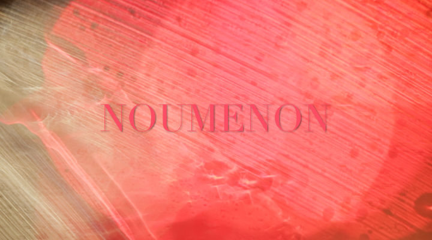
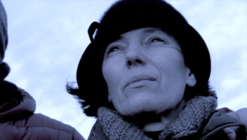
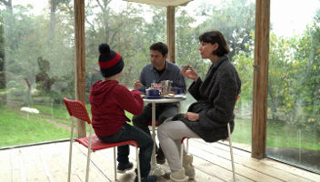
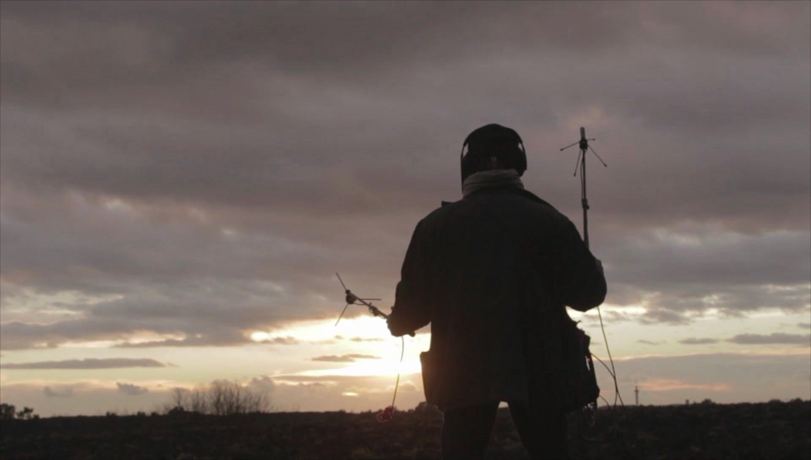
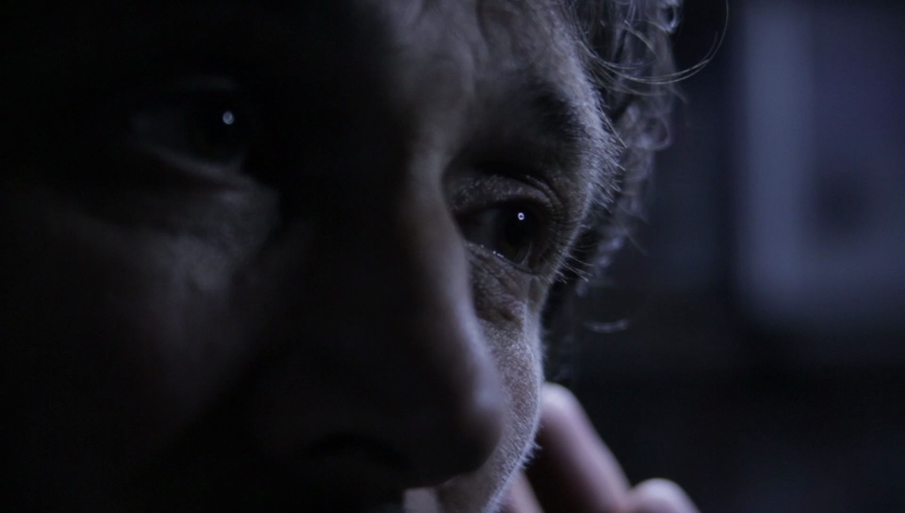

<!-- Banner --> 
<section id="banner">
						

							<h2>{{ site.title }}</h2>
							
{{ site.description | markdownify }}

						

						<a href="#two" class="more scrolly">Learn More</a>
</section>
  
<!-- Two -->
<section  id="two" class="wrapper alt style2"> 
<section class="spotlight">
            

            
            

            

            <h2><a href="https://studios.amazon.com/projects/154741#player/179935" >Noumenon </a></h2> 
			     

            

</section>

<section  id="two" class="wrapper alt style2"> 
<section class="spotlight">
            

                
            

            

	           <h2>Project  DESCRIPTION</h2> 
			     
Cryptmoon is a series that reveals the invisible clash of obscure energies that surrounds us and that can take possession of our conscience, leading us to commit extreme acts. 
                  
                 One of these forces is called Verbus: it enters the body of the protagonist and generates a double personality in him, but this is visible only to Crypt, his rival: a man who by means of Metaphonia - the recording of sounds that arrive from the spirit world - tries to intercept him and figure out his evil plans..

            

</section>
<section class="spotlight">
            

                
            

        

            <h2>Plot</h2>
            

            Roberto, Samuele’s father, after following his wife Luisa, discovers that she is having a love affair with Alessandro. This revelation fills him with panic and his state of despair evokes the arrival of Verbus, his dark side alter ego. Verbus offers him a way out, but there is a terrible price to pay to obtain it.
             
            Only Crypt, a keen investigator of the occult, finds out about the evil plan that Verbus is proposing to Roberto…
            

		

		</section>
		<section class="spotlight">
							

								<h2>Il progetto</h2>
				
Cryptmoon è un progetto seriale che parla  dell’eterna battaglia tra il bene e il male. Ma il male in questa serie  è visto come un’energia che aleggia intorno a noi….e che può impossessarsi di chiunque… e di conseguenza condizionarlo  a uccidere persone care che spesso fanno parte della sua famiglia …….  questa energia ha il potere di penetrare nel corpo del protagonista e generare uno sdoppiamento di personalità ….. ha un nome proprio si chiama Verbus, ma è visibile soltanto dal protagonista e da Crypt Crypt è il suo rivale. Un  uomo che  attraverso il suo hobby ( la Metafonia, cioè attraverso la registrazione dei suoni che provengono dall’occulto ) cerca di intercettarlo e di intuire i suoi piani malvagi?  e fa di tutto per dissuaderlo dal  portarli a termine

							

</section>
<section class="spotlight">
							

                            
                            

								<h2>Sinossi</h2>
								
Roberto, dopo aver seguito la moglie Luisa,  scopre che si incontra con  Alessandro. e che Luisa e Alessandro sono innamorati! Questa scoperta getta Roberto nel panico e dopo una nottata di disperazione, arriva Verbus. la sua contro parte oscura, che gli offre una via d’uscita, ma c'è un prezzo da pagare?  il piano di Verbus  viene scoperto da Cript, un uomo che attraverso delle antenne collegate a cristalli riesce ad ascoltare Verbus e ad elaborare un piano per dissuaderlo. Ma il viaggio è lungo.

   							

</section>
<section class="article" width= "90%" >

 <h2>Premessa</h2>

                               
         
Nella Medicina Tradizionale Cinese, le 4 energie patogene vento – umidità – freddo - calore,vengono considerate come "Entità" cioè energie/forze vitali, organizzate secondo determinate caratteristiche e con una sorta di individualità.

Il trattamento delle problematiche fisiche, causate dal loro insinuarsi e insediarsi nel corpo, dipende proprio dall'individuazione dell'entità responsabile e dal grado di penetrazione di questa oltre le barriere difensive corporee. 

In Cript,  un dolore che supera la soglia della sopportazione, diventa una condensazione di energia esplosiva. Dalla detonazione  ecco che viene al mondo questa creatura impalpabile. L' entità, prende corpo, assume un carattere, un atteggiamento. In certi momenti sembra prevalere sull'umano a cui è legato. 

Chiamarla malattia è troppo generico. Non si tiene conto di come è stata generata e di chi le dà vita. E in fondo, ricollegandomi alla premessa, anche il vento non è mai sempre lo stesso vento.

Per questo, le spetta un nome proprio. Si chiama Verbus.
Come ogni altra creatura, anche Verbus lotta per la sopravvivenza. Il suo cibo scaturisce  dalle lacerazioni interne di Roberto. Si nutre della sua energia e succhia la sua luce. 

Roberto lo sa di non essere più solo ma lascia che tutto accada. Vivere in parassitosi gli sembra più facile che risanare il suo cuore e il suo spirito. Man mano che cede il suo potere personale a Verbus, questi cresce, si irrobustisce, ha contorni sempre più precisi, una voce sempre più forte, che risuona nella testa di Roberto con arroganza. 

Chi è invece Cript, è un mistero. Strano è il suo armamentario. Alcuni suoi strumenti sembrano antenne. In effetti cerca di captare qualcosa. Inizialmente si potrebbe pensare che sia a caccia di suoni, ma è molto di più. Cript si è attrezzato proprio per  scovare  un certo tipo di entità sottili che vibrano nell'etere, per connettersi con loro. 

Ma cosa lo spinge a fare questo? E cosa vuole ottenere? 
Cript, arriva ad  individuare Verbus e una volta creato il contatto, lo affronta, lo sfida, ingaggia un duello, lo sfinisce, tanto che Verbus perde forza e fugge da lui.

Ma esiste  poi una strumentazione veramente capace di annullare o cacciare definitivamente un' entità? 
Viene da chiedersi se quella di Cript è una lotta contro i mulini a vento, o se è invece una rappresentazione, una messa in scena simbolica, per affrontare qualcosa che  conosce molto bene, che è già dentro di lui da tempo, la sua personale “creatura”. 

Verbus comunque riappare, in macchina, sul sedile posteriore, mentre Roberto guida serenamente. Stavolta  Verbus è  taciturno, inerte. È  stato depotenziato ma non integrato e riassorbito. Continua ad esserci,finché non verrà innescato di nuovo e allora continuerà la storia.

 
Cristina Del Buon

</section>
<!-- Three -->

   